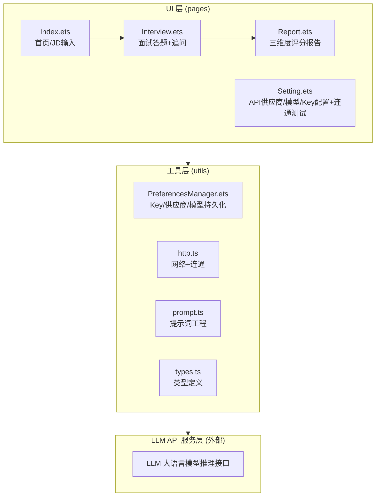
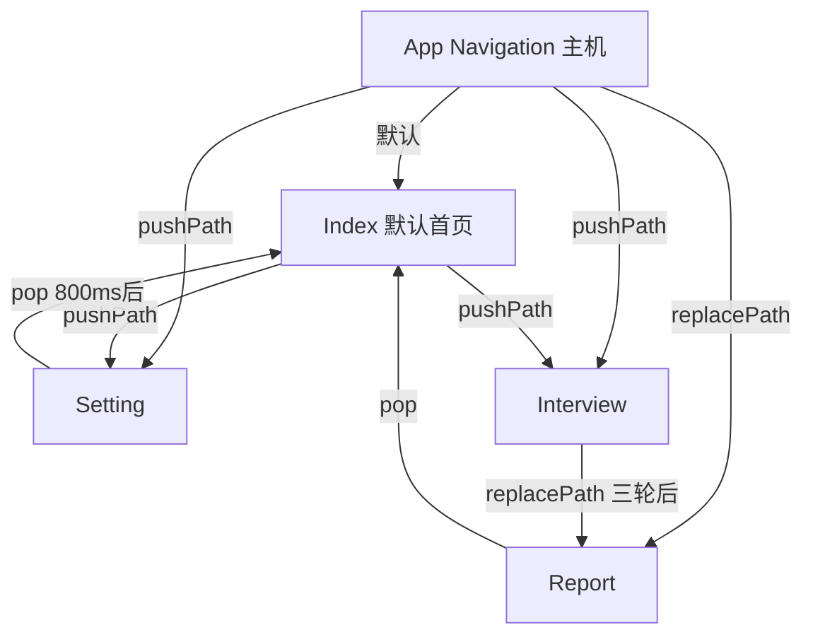

# AIInterviewer 项目架构总览

> AI 模拟面试官 · HarmonyOS 应用 · SDK 6.1.1 · Stage 模型

## 技术栈

| 维度 | 选用技术 |
|---|---|
| 语言 | ArkTS（TypeScript 超集）+ ArkUI 声明式 UI |
| 框架 | HarmonyOS SDK 6.1.1，Stage 模型 |
| 构建 | Hvigor（`hvigorw assembleHap`） |
| IDE | DevEco Studio |
| 包管理 | ohpm（`oh-package-lock.json5`） |
| 测试 | `@ohos/hypium`（describe/it/expect） |
| 网络 | `@ohos.net.http` |
| 持久化 | `@ohos.data.preferences`（ArkData） |
| 日志 | `@kit.PerformanceAnalysisKit` / `hilog`，DOMAIN = `0x0000` |

## 模块分层

项目采用经典三层架构，各层职责明确、单向依赖：



### 层间通信规则

- **UI 层 → 工具层**：页面通过 `import` 调用 utils 导出函数，传递 `Context` 和业务参数
- **工具层 → LLM API**：`http.ts` 封装 POST/GET 请求，携带 API Key 和 prompt 负载
- **UI 层禁止直接调用网络 API**：所有网络请求经过 `utils/http.ts`
- **UI 层禁止直接读写 Preferences**：通过 `utils/PreferencesManager.ets` 操作

## 当前代码资产

```
entry/src/main/ets/
├── entryability/EntryAbility.ets
├── entrybackupability/EntryBackupAbility.ets
├── pages/
│   ├── App.ets             # Navigation 路由主机（@Entry 入口）
│   ├── Index.ets           # 首页：JD输入/粘贴、模型切换、余额展示
│   ├── Interview.ets       # 面试页：JD解析→3轮出题+追问→评分→跳转Report
│   ├── Report.ets          # 报告页：综合评分+三维度（技术/表达/逻辑）评分+建议
│   └── Setting.ets         # 配置页：供应商选择、API Key输入、连通测试、模型列表、余额查询
└── utils/
    ├── types.ts            # ParsedJD, InterviewQuestion, QAPair, InterviewReport, FollowUpItem, DimensionScore
    ├── PreferencesManager.ets  # saveApiKey/getApiKey/hasApiKey, saveProvider/getProvider/getEndpoint,
    │                         # saveModel/getModel, saveTestCache/getTestCache/clearTestCache,
    │                         # BUILTIN_ENDPOINTS/DEFAULT_MODELS/DEFAULT_PROVIDER/TestCache 常量+接口
    ├── http.ts             # post, testConnection, fetchModels, fetchBalance
    └── prompt.ts           # callLLM, buildJDPrompt/parseJDResponse, buildQuestionPrompt/parseQuestionResponse,
                          # buildFollowUpPrompt/parseFollowUpResponse, buildReportPrompt/parseReportResponse
```

### 已实现 vs 规划中

| 模块 | 状态 |
|---|---|
| 5 个页面 (App/Index/Interview/Report/Setting) + 1 个 Ability | ✅ 已实现 |
| utils 层全部 4 个模块 | ✅ 已实现 |
| DeepSeek/OpenAI 双供应商 | ✅ 已实现 |
| 连通性测试 + 模型列表拉取 + 余额查询 + TestCache 缓存 | ✅ 已实现 |
| 流式输出（LLM 边收边渲染） | 🔄 Phase 3 |
| 分布式数据对象（手机→平板同步） | 🔄 Phase 3 |
| 元服务卡片 | 🔄 Phase 4 |

## 路由设计

应用采用 `Navigation` + `NavPathStack` 架构（`@ohos.router` 在 API 24 已废弃）。

路由入口注册在 `entry/src/main/resources/base/profile/main_pages.json`：

```json
{
  "src": [
    "pages/App"
  ]
}
```

`App.ets` 作为 `@Entry` 路由主机，承载 `Navigation` 组件并通过 `@Builder NavDestinationBuilder` 按名称分发子页面（`'Interview'` / `'Report'` / `'Setting'`）。`NavPathStack` 为空时默认显示 `IndexPage`。

| 操作 | 旧 router API | 新 Navigation API |
|---|---|---|
| 跳转 | `router.pushUrl` | `navStack.pushPath({ name, param })` |
| 替换 | `router.replaceUrl` | `navStack.replacePath({ name, param })` |
| 返回 | `router.back` | `navStack.pop()` |
| 传参 | `router.params` | `NavPathInfo.param` |

所有子页面实现为 `@Component export struct` + `NavDestination()`，不再使用 `@Entry` 装饰。

## 页面状态机



- **App**：`Navigation` 容器，`NavPathStack` 为空时展示 `IndexPage`
- **Index**：JD 输入/粘贴、模型快速切换、余额展示 → 点击"开始面试" `pushPath` 到 Interview；点击设置 `pushPath` 到 Setting；无 API Key 时自动 `replacePath` 到 Setting
- **Interview**：7 态状态机（`loading_jd` → `loading_question` → `awaiting_answer` → `loading_followup` → `awaiting_followup_answer` → 循环×3轮 → `loading_report`） → `replacePath` 到 Report
- **Report**：展示三维度评分报告 → "再来一次" `pop` 回 Index
- **Setting**：配置供应商/Key/模型、连通测试 → 保存成功后 800ms 延迟 `pop` 回 Index

## API 设计原则

1. **无第三方 SDK 依赖** — 所有网络请求使用 `@ohos.net.http` 原生 API
2. **API Key 运行时配置** — 通过 Preferences 存储，不硬编码
3. **超时配置** — connectTimeout=15s, readTimeout=30s，避免默认 60s 超时导致"卡死"
4. **请求封装** — `utils/http.ts` 统一处理 Authorization 头、JSON 序列化、错误处理、非 2xx 异常

## 关键文件路径

| 用途 | 路径 |
|---|---|
| 应用入口 | `entry/src/main/ets/entryability/EntryAbility.ets` |
| 首页 | `entry/src/main/ets/pages/Index.ets` |
| 工具层 | `entry/src/main/ets/utils/` |
| 资源文件 | `entry/src/main/resources/base/element/` |
| 路由配置 | `entry/src/main/resources/base/profile/main_pages.json` |
| 构建配置 | `build-profile.json5` |
| 文档目录 | `docs/` |
