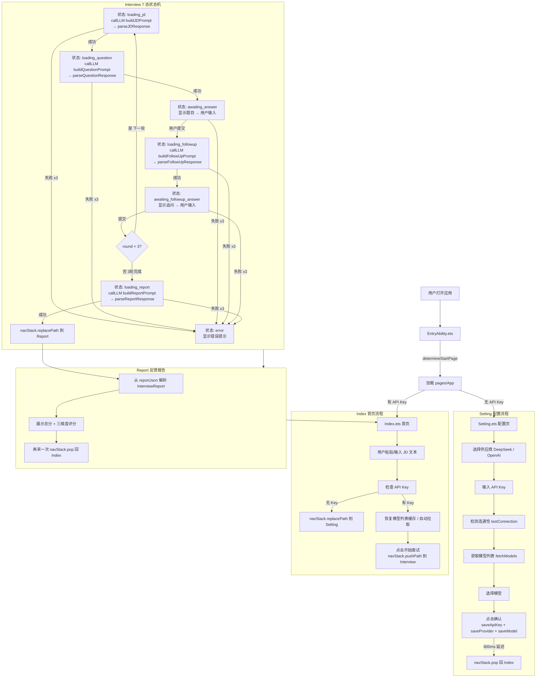
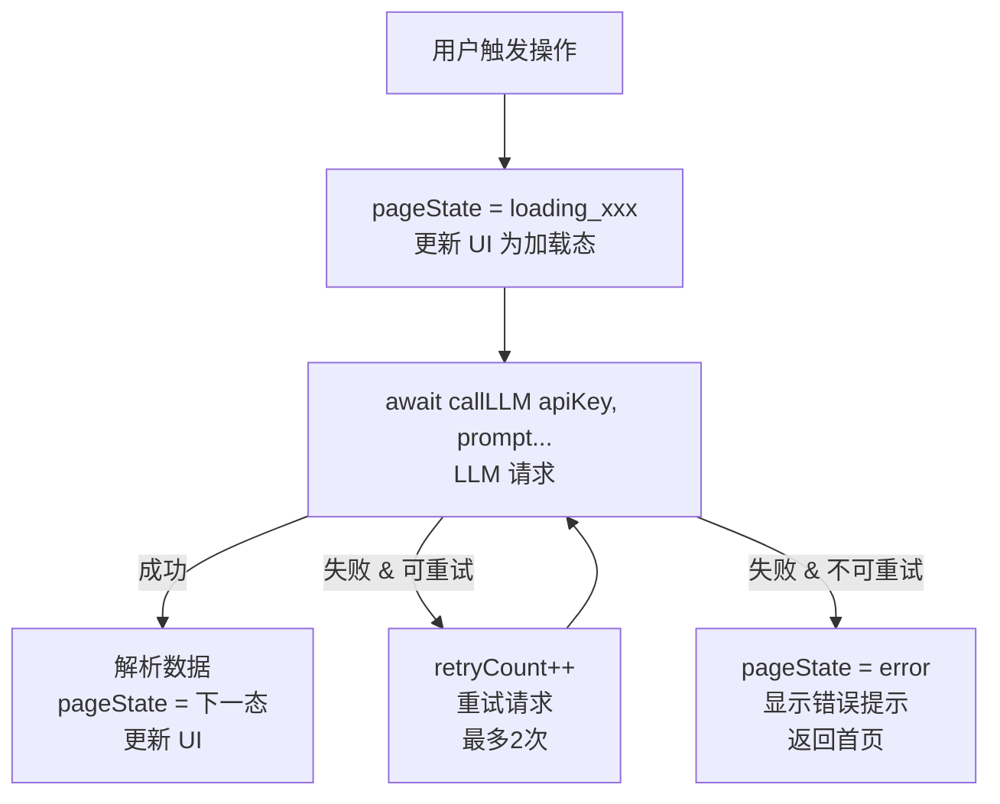

# AIInterviewer 数据流与状态管理

## 1. 完整面试流程数据流



## 2. 关键数据对象生命周期

### apiKey / provider / model（持久化配置）

```
创建: Setting.ets → saveApiKey() + saveProvider() + saveModel()
读取: Index.ets / Interview.ets → getApiKey() + getProvider() + getModel()
持久化: Preferences（应用私有目录）
销毁: 用户手动清除或卸载应用
```

### ParsedJD（JD 解析结果）

```
创建: Interview.ets loading_jd 阶段（callLLM → parseJDResponse）
使用: Interview.ets 全流程（生成题目、追问、评分）
传递: Interview.ets @State → 仅面试页使用（不跨页传 ParsedJD）
销毁: 面试结束或页面销毁
```

### QAPair[]（问答历史）

```
创建: Interview.ets loading_question 阶段（首轮题目生成后初始化）
追加: 每轮用户回答 + 追问回答
使用: Interview.ets loading_followup 追问 → loading_report 评分
传递: Interview.ets @State（不跨页传，Report 使用评分结果）
销毁: 面试结束或页面销毁
```

### InterviewReport（评分报告）

```
创建: Interview.ets loading_report 阶段（callLLM → parseReportResponse）
使用: Report.ets 渲染
传递: NavPathInfo.param（JSON.stringify 序列化后传递）
持久化: 规划中（本地留存面试记录）
```

## 3. 状态管理策略

### 当前方案：@State 局部状态

ArkUI 声明式 `@State` 装饰器，每个页面独立管理自己的状态。

```typescript
// Index.ets
@State jdText: string = '';
@State hasKey: boolean = false;
@State selectedModel: string = '';
@State modelOptions: SelectOption[] = [];
@State modelIndex: number = 0;
@State balanceInfo: string = '';
@State connectionStatus: string = '';
@State statusType: string = '';

// Interview.ets — 7 态状态机（pageState 使用字符串字面量）
@State pageState: string = 'loading_jd';
@State parsedJD: ParsedJD | null = null;
@State currentRound: number = 1;
@State currentQuestion: InterviewQuestion | null = null;
@State currentAnswer: string = '';
@State followUpQuestion: string = '';
@State followUpAnswer: string = '';
@State qaHistory: QAPair[] = [];
@State errorMessage: string = '';
@State retryCount: number = 0;

// Report.ets
@State report: InterviewReport | null = null;

// Setting.ets
@State providerIndex: number = 0;
@State apiKeyInput: string = '';
@State testResult: string = '';
@State isTesting: boolean = false;
@State balanceInfo: string = '';
@State modelOptions: SelectOption[] = [];
@State modelIndex: number = 0;
@State selectedModel: string = '';
@State savedFeedback: boolean = false;
@State isApiFocused: boolean = false;
```

### 跨页面数据传递：NavPathStack + NavPathInfo

```typescript
// Index → Interview
this.navStack.pushPath({
  name: 'Interview',
  param: { jdText: this.jdText }
});

// Interview → Report
this.navStack.replacePath({
  name: 'Report',
  param: { reportJson: JSON.stringify(this.report) }
});

// Setting → Index
this.navStack.pop();
```

页面通过 `NavDestination` 的 `onReady` 回调接收参数：

```typescript
.onReady((context: NavDestinationContext) => {
  if (context?.pathInfo?.param) {
    this.params = context.pathInfo.param as Record<string, Object>;
  }
});
```

### 未来可选：@Provide / @Consume

如果页面组件树变深（如弹窗、子组件），可以用 `@Provide` / `@Consume` 替代 prop drilling。

## 4. 异步操作流



**错误类型与处理策略：**

| 错误场景 | 处理方式 |
|---|---|
| 网络不可用（超时 / DNS 失败） | 提示"网络连接失败"→ 重试（最多 2 次）|
| API Key 无效（401） | 提示"API Key 无效"→ 跳转 Setting 重新配置 |
| LLM 返回格式异常（JSON 解析失败） | 提示"解析失败"→ 重试（最多 2 次） |
| API 错误码（400/500） | 提示"服务异常"→ 重试（最多 2 次） |
| 页面被系统回收 | 所有 @State 数据丢失，需重新开始 |

## 5. 缓存与持久化

| 数据类型 | 存储方式 | 生命周期 |
|---|---|---|
| API Key | Preferences（`saveApiKey`） | 持久化，用户手动清除或覆盖 |
| 供应商名 | Preferences（`saveProvider`） | 持久化 |
| 模型名 | Preferences（`saveModel`） | 持久化 |
| 连接测试缓存（模型列表/余额/测试结果） | Preferences（`saveTestCache`） | 持久化，供应商/Key 变更时清除 |
| 面试记录 | Preferences（规划中） | 持久化，可查看历史 |
| JD 解析缓存 | @State（Interview.ets） | 面试页面生命周期 |
| 问答历史 | @State → NavPathInfo param | 面试→报告传递后释放 |
| LLM 请求响应 | 无缓存（每次请求独立） | 用完即弃 |

## 6. 性能与鸿蒙特性规划

### SSE 流式输出（已评估，不实现）

经实测，`@ohos.net.http` 的 `on('dataReceive')` 回调对 SSE（`text/event-stream` Content-Type + chunked transfer）响应**不触发**。`http.ts` 的 `streamPost()` 已实现 Promise 兜底方案：请求完成后从 `resp.result` 获取完整 SSE 响应体，通过 `SSESplitter.feedText()` 一次性解析所有 content delta。

如需真正的增量流式渲染，唯一的路径是使用 `@ohos.net.socket` 手动建立 TCP 连接并逐字节解析 SSE — 当前优先级不匹配，决定不实现。

### 分布式数据对象（Phase 3 — 已实现）

面试进度通过 `@ohos.data.distributedDataObject` 在手机和平板间同步：

**数据载荷（`InterviewSyncData`）**：
- `currentRound: number` — 当前面试轮次
- `pageState: string` — 页面状态（`jd_parsed` / `question_ready` / `awaiting_answer` / `report_ready`）
- `jdText: string` — JD 文本（初始启动后同步）
- `reportJson: string` — 评分报告 JSON（面试完成后同步）

**同步流程**：
1. **主设备（Interview 页）**：`aboutToAppear` 时检查 `DistributedEnabled` 开关，若开启则 `createDistributedSession()汇总`，在 JD 解析/出题/页面状态变更/报告生成各节点调用 `updateSyncField()` 写入
2. **副设备（平板）**：通过 `getSyncField()` 实时读取当前状态，实现进度同步
3. **清理**：Interview 页 `aboutToDisappear` 时释放 `distributedObj` 引用

**开关控制**：`saveDistributedEnabled(context, true/false)` / `getDistributedEnabled(context)`，默认关闭，通过 Preferences 持久化。
